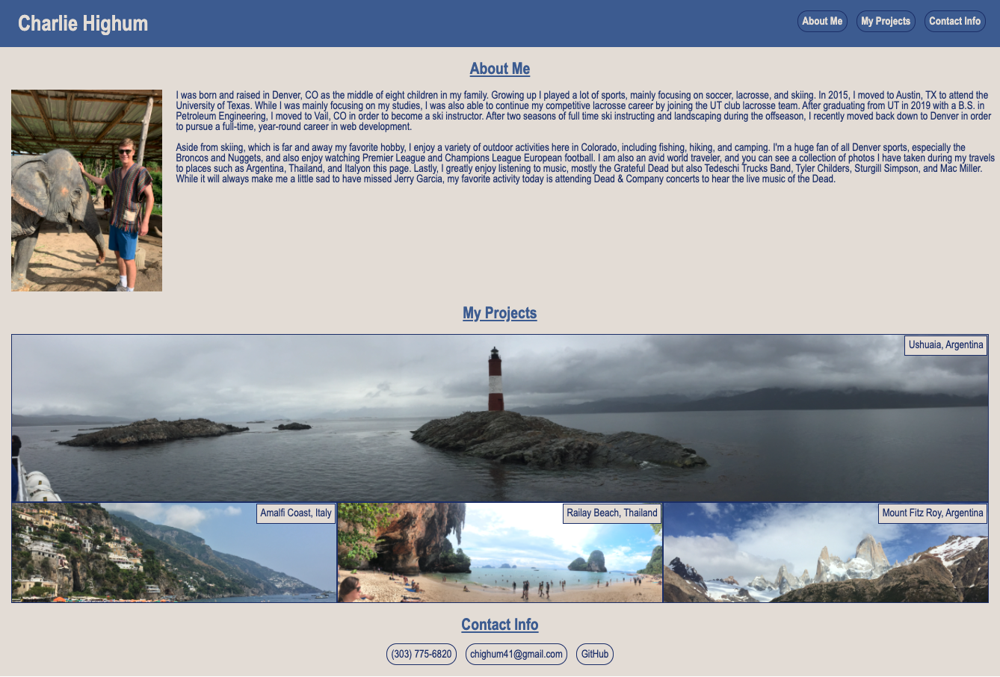
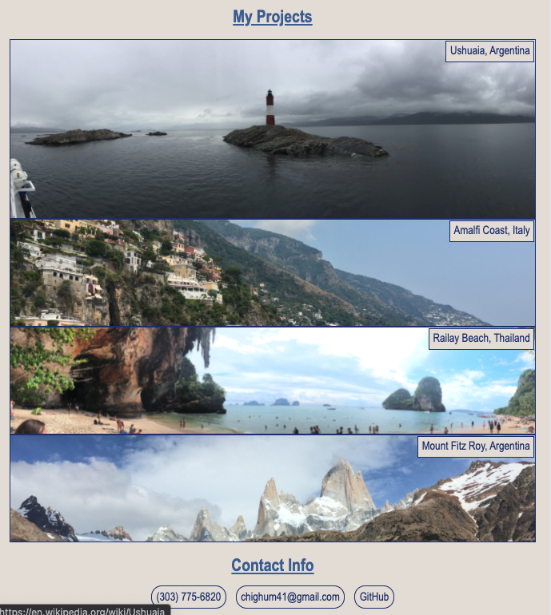
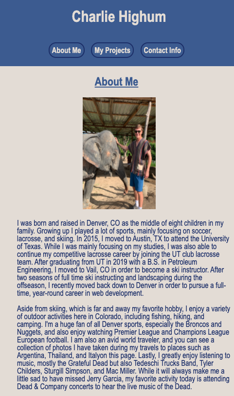

# Homework2-Portfolio

## Description

For Homework 2 of the DU coding bootcamp I was tasked with creating a portfolio page to store all of my projects throughout this course and beyond. This will be very helpful for me when I am going through the hiring process and will be able to show potential employers all of my coding work on one nicely formatted page.

This assignment also helped me strengthen my knowledge of both HTML and CSS and how they work together. More spefically, this assignment helped with my knowledge of flex-boxes as that was how I decided to design the entire page which took a lot of tinkering to look just the way I wanted it. It also helped me with implementing media queries, allowing the page to be nicely formatted as the viewport changes sizes.

For right now because I do not have any true coding projects of my own, other than this repository, the project links take you to info about what is shown in the respective picture. As I create new projects throughout this course I will replace my travel photos and labels with relevant photos and labels for the project and replace the current links with links to the deployed application.

## Usage

You can access my deployed portfolio page, which will be updated continuously, by visiting: https://chighum.github.io/Homework2-Portfolio/

You can also see screenshots of the deployed application below at three different viewport sizes:

Computer Size:

Tablet Size:

Phone Size:

